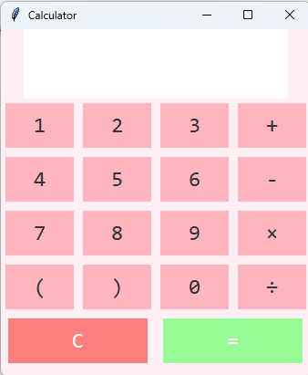

# Simple GUI Calculator 🧮

A basic calculator built with Python's Tkinter library. This calculator supports standard arithmetic operations with a soft, user-friendly interface.

## ✨ Features

- Addition, Subtraction, Multiplication, Division
- Parentheses for grouping
- Clear and evaluate functionality
- Beautiful soft color palette
- Responsive button layout with padding for better UX

## 📸 Preview

  

## 🧰 Technologies Used

- Python 🐍
- Tkinter for GUI

## 💻 How to Run

1. Make sure Python is installed on your system.
2. Save the code to a file named `calc.py`.
3. Run the program:
   ```bash
   python calc.py

## 🎨 Design Theme
Background: Light pink (#FFF0F5)

Buttons: Soft pink (#ffb6c1)

Text color: Dark gray (#333333)

Clear button: Soft red (#ff7f7f)

Equal button: Soft green (#98fb98)

Flat button style with subtle padding

## 📖 Code Overview
  ```python
      add_to_calculation(symbol): Appends the input to the display.
      
      evaluate_calculation(): Evaluates the current expression safely.
      
      clear_field(): Clears the input field.
```
      
Layout managed using ```grid()``` with consistent ```padx```/```pady```.


## 🚧 Warning
This project uses Python’s built-in ```eval()``` function to process input, which can be unsafe for user-generated content. Use only in learning/demo environments.
